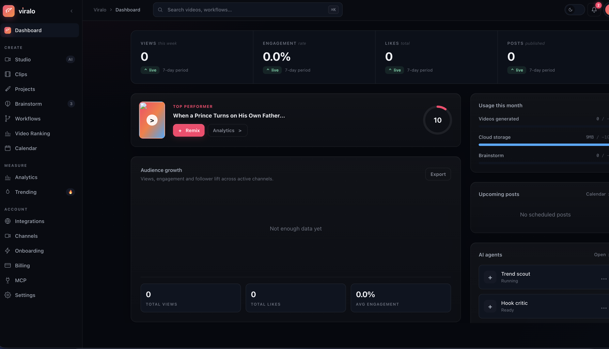
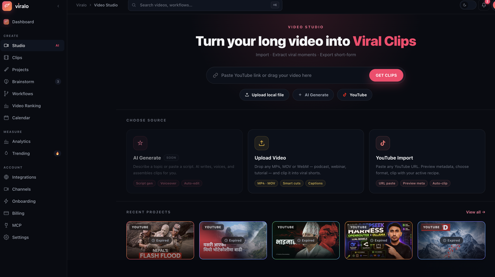
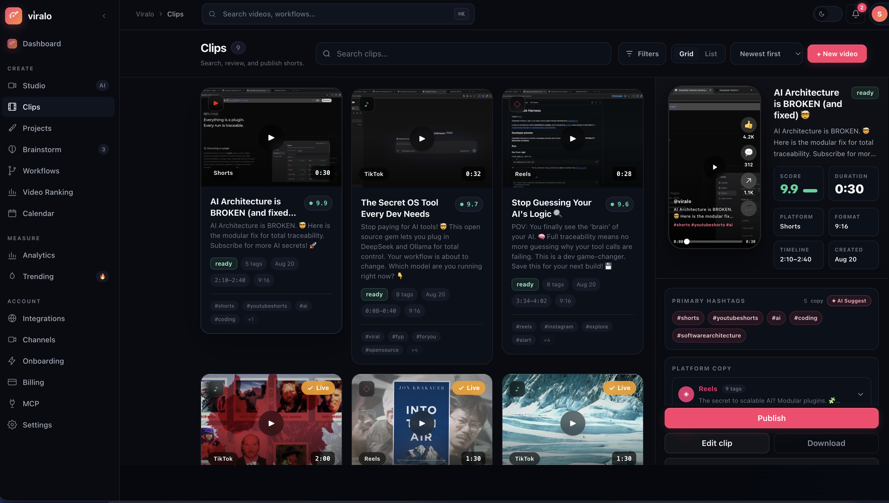

# Viralo

**Turn any idea into viral short videos.** Viralo extracts the best clips from long-form content, adds captions, and auto-publishes to TikTok, Instagram, YouTube Shorts, and 50+ other platforms.

Open-source, self-hostable, FastAPI microservices + React/Vite frontend.

**🚀 Live demo: [app.viraloapp.tech](https://app.viraloapp.tech)** — try it before you self-host.

---

## Screenshots

| Dashboard | Video Studio | Clips |
|---|---|---|
|  |  |  |

---

## Quick install (one command)

Requires [Docker](https://docs.docker.com/get-docker/) and Docker Compose.

```bash
git clone https://github.com/sammyview80/viralo.git
cd viralo
./scripts/install.sh
```

That's it. The script:
- creates `.env` from `.env.example` and auto-generates strong secrets (DB password, RabbitMQ password, `SECRET_KEY`, `ENCRYPTION_KEY`, `ADMIN_JWT_SECRET`),
- builds every service image,
- starts the full stack via Docker Compose,
- waits for core services to report healthy,
- prints the URLs when ready.

Then open **http://localhost:3000**.

Re-running `./scripts/install.sh` is safe — it never overwrites an existing `.env`.

### Remote one-liner

```bash
curl -fsSL https://raw.githubusercontent.com/sammyview80/viralo/main/scripts/install.sh -o install.sh && bash install.sh
```
(Run this from an empty directory after `git clone`, or adjust to clone first — the script expects to run inside the repo so it can build the compose services.)

---

## What you get

| Service | Port | Purpose |
|---|---|---|
| `frontend` | 3000 | React/Vite web app |
| `core-service` | 8001 | Auth, tenants, orgs |
| `video-service` | 8003 | Clip extraction, captions, rendering |
| `agent-service` | 8004 | AI agent orchestration |
| `workflow-service` | 8005 | Workflow/automation engine |
| `platform-service` | 8006 | Social publishing, analytics, notifications |
| `postgres` | 5433→5432 | Primary database |
| `redis` | 6379 | Cache / broker support |
| `rabbitmq` | 5672 / 15672 | Task queue + management UI |
| `flower` (dev profile) | 5555 | Celery task monitor |

Background workers (`celery-video-pipeline`, `celery-video-ai`, `celery-video-upload`, `celery-video-generate`, `celery-agent`, `celery-workflow`, `celery-post`, `celery-notification`, `celery-beat`) handle video processing, agent runs, workflow execution, and scheduled publishing.

---

## Manual install (without the script)

```bash
cp .env.example .env
# edit .env: set POSTGRES_PASSWORD, RABBITMQ_PASS, SECRET_KEY, ENCRYPTION_KEY, ADMIN_JWT_SECRET
# make sure DATABASE_URL / RABBITMQ_URL passwords match what you set above

touch yt-cookies.txt   # required even if empty
docker compose build
docker compose up -d
```

Check status:
```bash
docker compose ps
docker compose logs -f
```

### Local development (hot reload)

```bash
make dev
# or: docker compose -f docker-compose.yml -f docker-compose.dev.yml up
```

### Database

```bash
make migrate   # run migrations across tenants
make seed      # seed dev data
make psql      # open a psql shell
```

### Frontend only

```bash
make fe-install
make fe-dev     # http://localhost:5173
make fe-build
```

### Tests & linting

```bash
make test          # full test suite (inside core-service container)
make test-unit
make test-int
make lint           # ruff + mypy
make format         # ruff format
```

---

## Configuration

All configuration lives in `.env` (see `.env.example` for the full list, grouped by section):

- **Core**: `DATABASE_URL`, `REDIS_URL`, `RABBITMQ_URL`
- **Security**: `SECRET_KEY`, `ENCRYPTION_KEY`, `ADMIN_JWT_SECRET` — required, generated automatically by `install.sh`
- **LLM providers** (optional, add the ones you use): `OPENAI_API_KEY`, `ANTHROPIC_API_KEY`, `GOOGLE_API_KEY`, `GROQ_API_KEY`, `OPENROUTER_API_KEY`, `CEREBRAS_API_KEY`, `SAMBANOVA_API_KEY`, `CLOUDFLARE_API_TOKEN` + `CLOUDFLARE_ACCOUNT_ID`
- **Storage** (pick one): Cloudinary (`CLOUDINARY_URL`), Cloudflare R2 (`CF_R2_*`), or S3 (`AWS_*`)
- **External APIs** (optional): `TAVILY_API_KEY`, `ELEVENLABS_API_KEY`, `PEXELS_API_KEY`, Stripe billing keys
- **OAuth / Email**: Google OAuth, SMTP credentials for transactional email
- **yt-dlp**: `YTDLP_COOKIES_FILE`, `YTDLP_PROXY`, `YTDLP_PROXY_LIST` for resilient YouTube downloads

Never commit `.env` — it's git-ignored. Never share its contents; it holds live secrets once generated.

---

## Production deployment

For a real server (not just local Docker), see `scripts/deploy.sh` — it hard-syncs the working tree to `origin/<branch>` (default `dev`), rebuilds only the images that changed, and recreates containers in place. Put nginx + TLS termination (Cloudflare, certbot, etc.) in front of `frontend`/`core-service` yourself; this repo ships the app layer, not the reverse proxy.

```bash
./scripts/deploy.sh                      # rebuild + recreate everything
./scripts/deploy.sh core-service         # only rebuild/recreate one service
```

---

## Architecture

FastAPI microservices, one per domain (`core`, `video`, `agent`, `workflow`, `platform`), sharing a common `shared/` package and Postgres database. Celery workers (backed by RabbitMQ) run the heavy async work — video rendering, AI calls, social publishing — off the request path. Frontend is a Vite + React SPA that talks to each service directly per its `VITE_*_BASE` env var.

See `docs/` for deeper design notes and `TODO.md` for the current roadmap.

---

## Contributing

Issues and PRs welcome — see [CONTRIBUTING.md](CONTRIBUTING.md) for branch conventions, code style, test requirements, and how to report security issues.

## License

See `LICENSE`.
